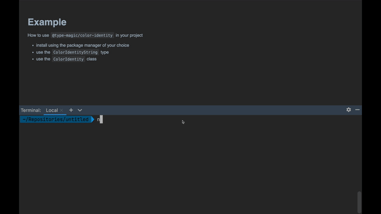

# type-magic 🧙

>Typescript library for working with the Magic color identity system 

## Table of Contents
- [Features](#features)
- [Usage Examples](#usage-examples)
- [Development](#development)

## Features

- **Type safety** and **IDE autocomplete** for Magic color identity strings
- Use the `ColorIdentityString` type to enforce the color identity syntax for strings
- The static API of `ColorIdentity` offers methods for working with color identities such as `add`, `subtract`, `contains`, `gte`, `subColorIdentities` and many more
- Instances of `ColorIdentity` provide a fluent interface for the same methods

## Usage Examples

### Installation in a `npm` project

Install the library in any `npm` project and import from `@type-magic/color-identity`:



### `ColorIdentityString` type
```typescript
// Define a ColorIdentityString to get strong typing for wubrg strings
const myId: ColorIdentityString = 'wubrg'
const myOtherId: ColorIdentityString = 'wbg'
const myThirdId: ColorIdentityString = ''
// const doesntCompile: ColorIdentityString = 'xyz' // Error!
```

### Static API of `ColorIdentity`
```typescript
// Use the static ColorIdentity API to work with color identity strings
ColorIdentity.add('wub', 'brg') // returns 'wubrg'
ColorIdentity.contains('wubr', 'br') // returns true
ColorIdentity.lt('u', 'ub') // returns true
ColorIdentity.components('wub') // returns ['', 'w', 'u', 'b']
ColorIdentity.subColorIdentities('wg') // returns ['', 'g', 'w', 'wg']
```


### Create `ColorIdentity` objects
```typescript
const myObj = new ColorIdentity('wubrg') // only accepts ColorIdentityString input
const myOtherObj = ColorIdentity.parse('wubrg') // accepts any string input and throws if invalid
const myThirdObj = ColorIdentity.parse('invalid') // Error!
```

### Fluent interface API of `ColorIdentity` objects
```typescript
myObj
  .subtract(ColorIdentity.FULL)
  .add('wbg')
  .subtract('b')
  .subColorIdentities() // ['', 'g', 'w', 'wg']
```

### The experimental `cid` function
```typescript
// Use the cid function for convenience:
// It is a shortcut that accepts either 
// - a valid color identity string
// - or a typescript template strings array, but without strong typing

// function syntax:
const myCid = cid('wubrg')
// const doesntCompile = cid('not a CI string') // Error!

// template strings array syntax:
const myOtherCid = cid`wubrg`
const myThirdCid = cid`will compile but throw error`
```

## Development

The `scripts` section of the `package.json` file contains everything that is needed
for working on this library.

| Script       | Description                                                                                                                                      |
|--------------|--------------------------------------------------------------------------------------------------------------------------------------------------|
| `clean`      | Deletes the  `dist/`  and  `coverage/`  directories that are generated when building or testing the project.                                     |
| `build`      | Builds the project using  `tsc` . This build is used for active development and debugging purposes.                                              |
| `build:prod` | Builds the project, but swaps out the build configuration file ( `tsconfig.prod.json` ). This build is used for public releases of this library. |
| `test`       | Runs all tests for the project with code coverage using  `jest`.                                                                                 |
| `test:watch` | Starts the  `jest`  unit test runner in watch mode.                                                                                              |
| `lint`       | Scans all typescript files for linting errors as specified in  `.eslintrc.js ` .                                                                 |
| `lint:fix`   | Runs the  `lint`  check and fixes each error if possible.                                                                                        |
| `prepublish` | An  `npm`  hook that is invoked whenever a version of this library is about to be `npm publish`ed.                                               |
