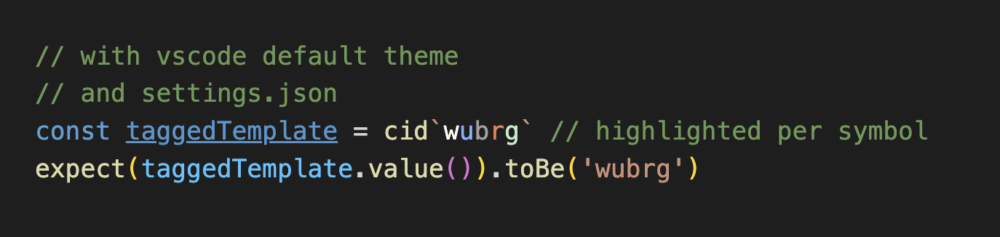

# @type-magic/vscode-extension 🧙

> Syntax highlighting addon for [@type-magic/color-identity](../color-identity/README.md)
> in [vscode](https://github.com/microsoft/vscode)

## Table of Contents

- [Features](#features)
- [Installation](#installation)
- [Usage](#usage)
- [Development Articles](#development-articles)

# Features

- Syntax highlighting for the tagged template function `cid`
  from [@type-magic/color-identity](../color-identity/README.md).
- Custom theming for the individual symbols

# Installation

## Building from source

At the moment, this extension is in its early development stages and
is not yet released publicly on the VSCode Marketplace.
To install the plugin, clone the [@type-magic/workspace](../../README.md) repository and
package the plugin by running `npm run -w packages/vscode-extension vsce:package`.
The script will build a `.vsix` file, which can then be manually installed from the
extensions menu in VSCode.

# Usage

## Basic Highlighting

The plugin will inject the `typescript` grammar and search for calls of the <code>cid\`...\`</code> tagged template.
The grammar simply searches for each individual color identity component and assigns a corresponding scope to the code
block (`keyword.color-identity.{w,u,b,r,g}`).
The default syntax highlighting of any theme will then pick up the color identity components as a `keyword` and
highlight it as such.


## Custom Highlight Colors per Symbol



Since the plugin assigns each individual color symbol a custom scope, it is possible to choose custom colors for each
symbol by modifying `.vscode/settings.json` of any project, or the global user settings.

With the simple JSON configuration below, each color symbol is highlighted in a custom color.
Open the command palette, search for `Preferences: Workspace Settings (JSON)` and add the following token color customizations:


```json lines
// .vscode/settings.json

{
  // ...
  "editor.tokenColorCustomizations": {
    "textMateRules": [
      {
        "scope": "keyword.color-identity.w",
        "settings": {
          "foreground": "#f9faf4"
        }
      },
      {
        "scope": "keyword.color-identity.u",
        "settings": {
          "foreground": "#b3ceea"
        }
      },
      {
        "scope": "keyword.color-identity.b",
        "settings": {
          "foreground": "#a69f9d"
        }
      },
      {
        "scope": "keyword.color-identity.r",
        "settings": {
          "foreground": "#eb9f82"
        }
      },
      {
        "scope": "keyword.color-identity.g",
        "settings": {
          "foreground": "#c4d3ca"
        }
      }
    ]
  },
  // ...
}
```

## Development Articles

- VSCode
  - [Your First Extension](https://code.visualstudio.com/api/get-started/your-first-extension)
  - [Syntax Highlighting Guide](https://code.visualstudio.com/api/language-extensions/syntax-highlight-guide)
  - [Color Theme](https://code.visualstudio.com/api/extension-guides/color-theme)
  - [Publishing Extensions](https://code.visualstudio.com/api/working-with-extensions/publishing-extension)
